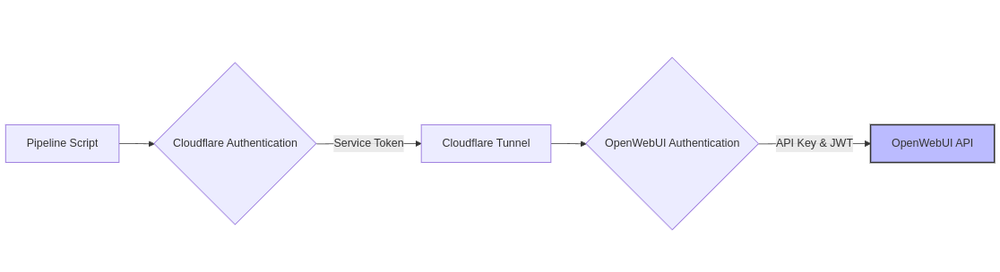
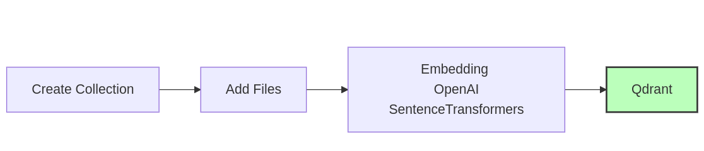

# GitHub to OpenWebUI Knowledge Pipeline

[](https://github.com/open-webui/open-webui)
 
[](https://github.com/username/github-to-openwebui-context-pipeline)
[](https://opensource.org/licenses/MIT)

 This repository models a functional and validated data pipeline pushing data from a Github repository into a vector database (Qdrant) via Open Web UI which serves as the AI chat frontend and directly manages the collections. 

 The hardest part of setting this pipeline up, as usual, was handling the Cloudflare authentication. For those not running their instances in the cloud (and specifically behind Access policies) this is one headache that you won't have to worry about. 

 The data pipeline scripts can be modified, although of course the API key and JWT tokens will still be required for authentication against Open Web UI API.
 

## Prerequisites

- An OpenWebUI instance
- Cloudflare for security (if applicable)
- Qdrant for vector database storage
- OpenAI for embeddings

## Quick Start

1. **Add your content**: Place your files in subdirectories under the `context-data/` directory
2. **Commit and push**: The GitHub workflow template will automatically sync your changes to OpenWebUI when implemented in your repository
3. **Done!** Your content is now available in your OpenWebUI knowledge collections

## How It Works

1. Each subdirectory in `context-data/` becomes a knowledge collection in OpenWebUI
2. The name of the subdirectory is converted to a collection name (e.g., `company-policies` becomes "Company Policies")
3. Files in each subdirectory are uploaded and added to the corresponding collection
4. When files are removed from a subdirectory, they are also removed from the collection

## Authentication Requirements

The pipeline requires the following authentication credentials:

1. **Cloudflare Service Token** - For accessing your Cloudflare-secured instance
2. **OpenWebUI API Key** - For authenticating with the OpenWebUI API
3. **JWT Key** - For OpenWebUI authentication

The workflow template uses the following secrets that need to be configured in your GitHub repository:

- `OWUI_BASE_URL`: URL of your OpenWebUI instance
- `OWUI_API_KEY`: API key for authentication
- `OWUI_JWT_TOKEN`: JWT token for authentication
- `CF_ACCESS_CLIENT_ID`: Cloudflare Access Client ID (if using Cloudflare Access)
- `CF_ACCESS_CLIENT_SECRET`: Cloudflare Access Client Secret (if using Cloudflare Access)

## Setup Instructions

1. **Enable Developer Mode in OpenWebUI**
   - It's recommended to start the OpenWebUI instance in dev mode to expose the Swagger documentation
   - The Swagger docs provide detailed information about the API endpoints for managing knowledge collections
   - Configure the ENV environment variable:
     ```
     ENV=dev  # Enables the FastAPI API docs on /docs
     # Alternative: ENV=prod - Automatically configures several environment variables
     ```

2. **Configure Cloudflare Access Policies**
   - In your Cloudflare Access Policies area, create a service token policy with the appropriate type
   - Create a service token for the script to use
   - Ensure the token is allowed in the policy (or allow all service tokens)

3. **Configure Authentication Credentials**
   - Set up the required Cloudflare service token
   - Configure the OpenWebUI API and JWT keys

## Authentication Flow



## Data Flow



1. Data is managed in your GitHub repository
2. The pipeline authenticates through the Cloudflare tunnel
3. The pipeline then authenticates with OpenWebUI
4. OpenWebUI handles collection creation and file uploading
5. Data is embedded into Qdrant for vector search capabilities

## Repository Structure

```
.
├── context-data/           # 👈 ADD YOUR CONTENT HERE
│   ├── collection-1/       # Each subdirectory becomes a knowledge collection
│   │   ├── document1.pdf
│   │   └── document2.md
│   └── collection-2/
│       └── document3.txt
├── .github/workflows/      # GitHub workflow configuration
├── code/                   # Source code for the sync script
├── tests/                  # Test scripts and files
└── config.template.json    # Template for configuration
```

## Local Development

To run the sync script locally:

1. Create a `config.json` file based on the template:
   ```bash
   cp config.template.json config.json
   # Edit config.json with your credentials
   ```

2. Install dependencies:
   ```bash
   pip install requests requests-toolbelt
   ```

3. Run the sync script:
   ```bash
   python code/src/sync_knowledge.py --base-dir context-data --config config.json --verbose
   ```

## Testing

To test the file upload functionality:

```bash
python tests/test_upload.py --file tests/test_file.txt --config config.json --verbose
```

## Supported File Types

- Text files (.txt), Markdown files (.md), PDF files (.pdf)
- Word documents (.docx), Excel spreadsheets (.xlsx), PowerPoint presentations (.pptx)
- CSV files (.csv), JSON files (.json), HTML files (.html)

## Notes

- Cloudflare authentication is the most challenging part of the setup
- Once authentication is properly configured, the pipeline operates seamlessly
- The system has been verified to work with Qdrant as the vector database and OpenAI for embeddings

## Acknowledgments

- Special thanks to [TheophileH](https://github.com/TheophileH) for pointing out the dev mode configuration fix that enables access to the Swagger documentation